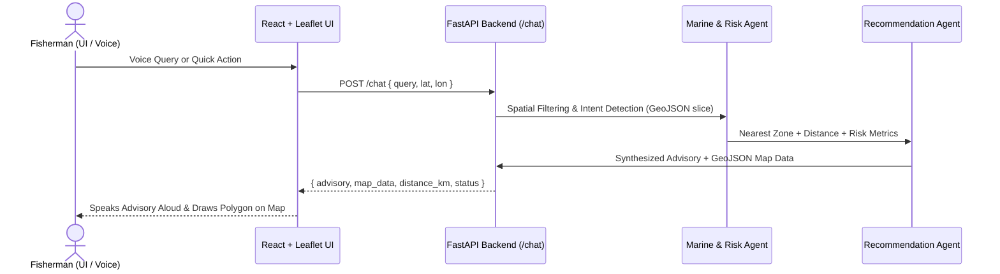

# ORCA — AI-Powered Marine Advisory System

> Prototype demonstration for Smart India Hackathon (SIH 2026).
> An agentic marine decision-support platform designed for coastal fishermen along the Rameswaram Coast and Gulf of Mannar region.

---

## 🌊 Overview

ORCA simulates real-world marine data processing without the latency or complexity of live satellite ETL pipelines by utilizing a static GeoJSON data slice of INCOIS Potential Fishing Zones (PFZs), sea surface temperature (SST), chlorophyll levels, wave heights, and the International Maritime Boundary Line (IMBL).

The system integrates an agentic **LangGraph** orchestrator running on **FastAPI** with a **React + Leaflet** web application, featuring voice interaction via the Web Speech API.

---

## 🏗 Architecture



---

## 📁 Repository Structure

```
SIH2026/
├── backend/
│   ├── data/
│   │   └── rameswaram_data.geojson   # Mock INCOIS PFZs & Hazard spatial slice
│   ├── main.py                       # FastAPI app + LangGraph multi-agent pipeline
│   └── requirements.txt              # Python dependencies
├── frontend/
│   ├── src/
│   │   ├── components/               # OceanMap, ChatPanel, AlertPanel, MobileDrawer
│   │   ├── services/                 # api.ts (FastAPI client), advisoryEngine.ts
│   │   ├── hooks/                    # useVoiceAssistant (Web Speech API)
│   │   ├── data/                     # mockData.ts
│   │   ├── types/                    # TypeScript interfaces
│   │   ├── App.tsx                   # Main application layout & agent integration
│   │   └── main.tsx
│   ├── package.json
│   ├── tailwind.config.js
│   └── vite.config.ts
└── README.md
```

---

## 🚀 Getting Started

### 1. Backend Setup

Ensure Python 3.10+ is installed:

```bash
cd backend
pip install -r requirements.txt
python main.py
```

The FastAPI backend will start on **`http://localhost:8000`**.
- Interactive API Docs: `http://localhost:8000/docs`
- Health check: `http://localhost:8000/health`

### 2. Frontend Setup

In a new terminal:

```bash
cd frontend
npm install
npm run dev
```

The application will be running at **`http://localhost:5173`**.

---

## 🎯 Key Features

- **Multi-Agent Retrieval & Reasoning**: LangGraph StateGraph filters spatial features and evaluates safety conditions (wave height > 2.5m, IMBL buffer proximity).
- **Dynamic Leaflet Map**: Real-time rendering of recommended fishing zones (green) and high-wave hazards (red) with coordinate flying.
- **Hands-Free Voice Interface**: Uses Web Speech API for speech-to-text recognition and text-to-speech advisory readouts.
- **Offline / Graceful Fallback**: Automatically falls back to local simulation if the backend server is unreachable.
